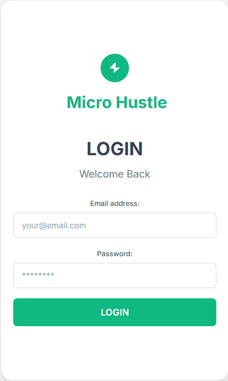

# Micro Hustle

*Micro Hustle is a mobile-style web app designed to help people earn quick and easy money by completing simple. This application was built using HTML, with the help of Gemini, and Chat GPT. 

The following features are implemented in the project:

- User can see GIGS to complete
- User can update their payment method
- User can message people to work with
- User can post gigs
- User can navigate to their profile and make changes
- User can see How much money they earned
- User can turn on notifications
  

## Project Design:

Here's a mockup and design of the project:

## Video Walkthrough:

Here's a walkthrough of implemented features:

## Notes and Comments

Describe any challenges encountered while building this project.

